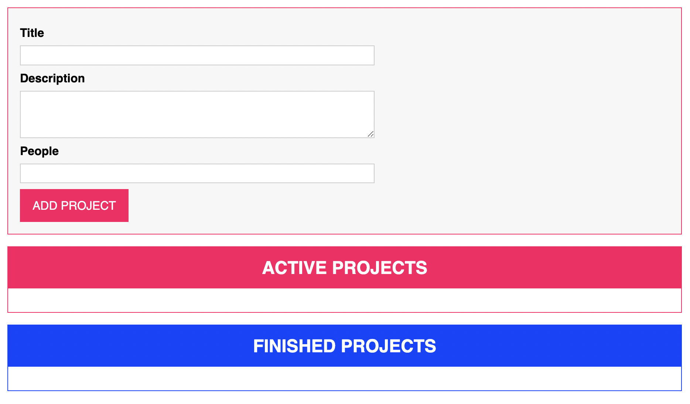
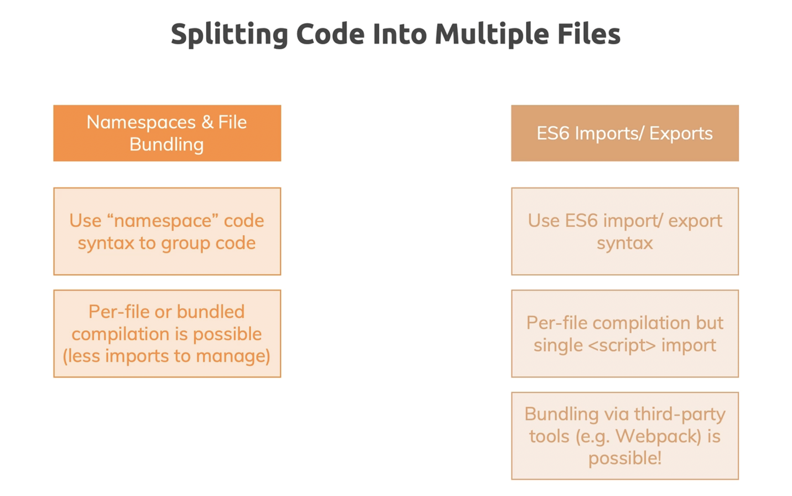

# Understanding Typescript - 2023 Edition

- [Understanding Typescript - 2023 Edition](#understanding-typescript---2023-edition)
  - [1. Section 1. Getting started](#1-section-1-getting-started)
    - [1.1. What is TS \& Why should you use it?](#11-what-is-ts--why-should-you-use-it)
    - [1.2. TypeScript Advantages](#12-typescript-advantages)
    - [1.3. Course outline](#13-course-outline)
    - [1.4. Boilerplat project](#14-boilerplat-project)
  - [2. Section 2. TypeScript Basics \& Basic Types](#2-section-2-typescript-basics--basic-types)
    - [2.1. Using types](#21-using-types)
    - [2.2. Typescript types vs Javascript types](#22-typescript-types-vs-javascript-types)
    - [2.3. Type Assignment \& Type Inference](#23-type-assignment--type-inference)
    - [2.4. Object Types](#24-object-types)
    - [2.5. Arrays Types](#25-arrays-types)
    - [2.6. Tuples](#26-tuples)
    - [2.7. Enums](#27-enums)
    - [2.8. The `any` type](#28-the-any-type)
    - [2.9. `union` types](#29-union-types)
    - [2.10. Literal Types](#210-literal-types)
    - [2.11. Type aliases / Custom types](#211-type-aliases--custom-types)
    - [2.12. Function return types \& `void`](#212-function-return-types--void)
    - [2.13. Function as Types](#213-function-as-types)
    - [2.14. Function types \& callbacks](#214-function-types--callbacks)
    - [2.15. The `unknown` type](#215-the-unknown-type)
    - [2.16. The `never` type](#216-the-never-type)
  - [3. Section 3: The `ts` compiler (and its configs)](#3-section-3-the-ts-compiler-and-its-configs)
    - [3.1. Using `watch` mode](#31-using-watch-mode)
    - [3.2. Compiling the entire project / multiple files](#32-compiling-the-entire-project--multiple-files)
    - [3.3. Including \& Excluding files](#33-including--excluding-files)
    - [3.4. Setting a compilation target](#34-setting-a-compilation-target)
    - [3.5. Understanding `ts` core `libs`](#35-understanding-ts-core-libs)
    - [3.6. Working with source maps](#36-working-with-source-maps)
    - [3.7. `rootDir` and `outDir`](#37-rootdir-and-outdir)
    - [3.8. Stop emitting files on compilation errors](#38-stop-emitting-files-on-compilation-errors)
    - [3.9. Strict compilation](#39-strict-compilation)
    - [3.10. Code quality options](#310-code-quality-options)
    - [3.11. Debugging with VSCode](#311-debugging-with-vscode)
  - [4. Section 4: Next-generation JS \& TS](#4-section-4-next-generation-js--ts)
    - [4.1. `let` and `const`](#41-let-and-const)
    - [4.2. Arrow function](#42-arrow-function)
    - [4.3. Default function parameters](#43-default-function-parameters)
    - [4.4. The spread operator `...`](#44-the-spread-operator-)
    - [4.5. Rest Parameters](#45-rest-parameters)
    - [4.6. Array \& Object destructuring](#46-array--object-destructuring)
    - [4.7. How code gets compiled](#47-how-code-gets-compiled)
  - [5. Section 5: Classes \& Interfaces](#5-section-5-classes--interfaces)
    - [5.1. What are `classes`?](#51-what-are-classes)
    - [5.2. `constructor` functioins \& the `this` keyword](#52-constructor-functioins--the-this-keyword)
    - [5.3. `private` and `public` access modifiers](#53-private-and-public-access-modifiers)
    - [5.4. Shorthand initialization](#54-shorthand-initialization)
    - [5.5. `readonly` properties](#55-readonly-properties)
    - [5.6. Inheritance](#56-inheritance)
    - [5.7. Overriding properties \& the `protected` modifier](#57-overriding-properties--the-protected-modifier)
    - [5.8. Getters \& Setters](#58-getters--setters)
    - [5.9. Static methods \& Properties](#59-static-methods--properties)
    - [5.10. Abstract classes](#510-abstract-classes)
    - [5.11. Singletons \& Private constructors](#511-singletons--private-constructors)
    - [5.12. `interface`](#512-interface)
    - [5.13. Using `interface` with `class`](#513-using-interface-with-class)
    - [5.14. Why `interface`?](#514-why-interface)
    - [5.15. Readonly interface properties](#515-readonly-interface-properties)
    - [5.16. Extending interface](#516-extending-interface)
    - [5.17. Interface as function type](#517-interface-as-function-type)
    - [5.18. Optional Parameters \& Properties](#518-optional-parameters--properties)
  - [6. Section 6: Advanced Types](#6-section-6-advanced-types)
    - [6.1. Intersection Types](#61-intersection-types)
    - [6.2. Type Guards](#62-type-guards)
    - [6.3. Discriminated Unions](#63-discriminated-unions)
    - [6.4. Type Casting](#64-type-casting)
    - [6.5. Index properties](#65-index-properties)
    - [6.6. Function overloads](#66-function-overloads)
    - [6.7. Optinal Chaining](#67-optinal-chaining)
    - [6.8. Nullish Coalescing](#68-nullish-coalescing)
  - [7. Section 7: Generics](#7-section-7-generics)
    - [7.1. What are `generics`?](#71-what-are-generics)
    - [7.2. Creating a `generic` function](#72-creating-a-generic-function)
    - [7.3. Working with `constraints`](#73-working-with-constraints)
    - [7.4. The `keyof` constraint](#74-the-keyof-constraint)
    - [7.5. Generic classes](#75-generic-classes)
    - [7.6. Generic utility types](#76-generic-utility-types)
    - [7.7. Generic types vs Union types](#77-generic-types-vs-union-types)
    - [7.8. Sumarry](#78-sumarry)
  - [8. Section 8: Decorators](#8-section-8-decorators)
    - [8.1. A first class decorator](#81-a-first-class-decorator)
    - [8.2. Working with `decorator factories`](#82-working-with-decorator-factories)
    - [8.3. Building more useful decorators](#83-building-more-useful-decorators)
    - [8.4. Adding multiple decorators](#84-adding-multiple-decorators)
    - [8.5. Diving into `property decorators`](#85-diving-into-property-decorators)
  - [9. Section 9: Drag \& Drop Project](#9-section-9-drag--drop-project)
    - [9.1. DOM element selection \& OOP rendering](#91-dom-element-selection--oop-rendering)
    - [9.2. Interacting with DOM elements](#92-interacting-with-dom-elements)
    - [9.3. Creating \& Using an `AutoBind` decorator](#93-creating--using-an-autobind-decorator)
    - [9.4. Fetching User Input](#94-fetching-user-input)
    - [9.5. Creating a re-usable validation functionality](#95-creating-a-re-usable-validation-functionality)
    - [9.6. Rendering Project Lists](#96-rendering-project-lists)
    - [9.7. Managing Application State with Singletons](#97-managing-application-state-with-singletons)
    - [9.8. More classes \& Custom types](#98-more-classes--custom-types)
    - [9.9. Filtering Projects with Enums](#99-filtering-projects-with-enums)
    - [9.10. Adding Inheritance \& Generics](#910-adding-inheritance--generics)
    - [9.11. Rendering Project Items with a Class](#911-rendering-project-items-with-a-class)
    - [9.12. Using `getter`](#912-using-getter)
    - [9.13. Utilizing interfaces to implement Drag \& Drop](#913-utilizing-interfaces-to-implement-drag--drop)
  - [10. Section 10: Modules \& Namespaces](#10-section-10-modules--namespaces)
    - [10.1. Writing module code](#101-writing-module-code)
    - [10.2. Working with `namespace`](#102-working-with-namespace)
    - [10.3. Complete `namespace` structure](#103-complete-namespace-structure)
    - [10.4. Using `ES modules`](#104-using-es-modules)
    - [10.5. Understanding various `import & export` syntaxes](#105-understanding-various-import--export-syntaxes)
    - [10.6. How does code in modules execute](#106-how-does-code-in-modules-execute)
  - [11. Section 11: Using `webpack` with `ts`](#11-section-11-using-webpack-with-ts)

## 1. Section 1. Getting started

### 1.1. What is TS & Why should you use it?

- A JS Supperset
- A language building up on JS
- Adds new features + Advantages to JS
- TS can't be executed by JS environments
- Need compiler to compile ts to js

Why TS?


### 1.2. TypeScript Advantages

Typescript adds

- Types
- Next-generation Javascript features (compiled down for older version)
- Non-JS features like `interfaces` or `generics`
- Meta-Programming features like `decorators`
- Rich configuration options
- Modern tooling that helps even in non-ts project

### 1.3. Course outline


### 1.4. Boilerplat project

`boilerplate`

- `index.html`
- `app.ts`
- `package.json`

```json
{
  "name": "boilerplate",
  "version": "1.0.0",
  "description": "",
  "main": "index.js",
  "scripts": {
    "start": "lite-server",
    "compile": "tsc *.ts"
  },
  "keywords": [],
  "author": "",
  "license": "ISC",
  "devDependencies": {
    "lite-server": "^2.6.1",
    "typescript": "^4.9.4"
  }
}
```

## 2. Section 2. TypeScript Basics & Basic Types

### 2.1. Using types

Core types

- `number`: no special type for `integer` or `float`
- `string`: `'hi'`, `"hi"`, \`hi\`
- `boolean`: `true`, `false`, no `truthy` or `falsy` values
- `object`
- `Array`

Types added by `ts`

- `Tuple`: a `fixed-length` array (`[1, 2]`)
- `Enum`: automatically enumerated global constant identifies
- `any`: any kind of value, no specific type assignment

```ts
function add(n1: number, n2: number): number {
  return n1 + n2;
}

const number1: number = 5;
const number2: number = 2.8;

const result = add(number1, number2);
console.log(result);
```

### 2.2. Typescript types vs Javascript types

Using `typeof` operator in `js`, checking the type at `runtime`

```js
function add(n1, n2) {
  if (typeof n1 !== "number") {
    throw new Error("");
  }

  if (typeof n2 !== "number") {
    throw new Error("");
  }
}
```

Using `ts` for type checking at `compile time`

> The key difference is: JS uses "dynamic types" (resolved at runtime).
> Typescript uses "static types" (set during development time)

The core primitive types in TS are all lowercase!

- `string` not `String`
- `number` not `Number`

### 2.3. Type Assignment & Type Inference

- Type assignment: we write type manually
- Type inference: TS try to figure out the variable type

### 2.4. Object Types

```ts
const person: {
  name: string;
  age: number;
} = {
  name: "hieu",
  age: 20,
};
```

### 2.5. Arrays Types

```ts
const numbers: number[] = [1, 2, 3];
const strings: string[] = ["a", "b", "c"];

const things: any[] = [1, "a", true];
```

### 2.6. Tuples

```ts
const adminRole: [number, string] = [1, "admin"];
const guestRole: [number, string] = [2, "guest"];

const csvColumns: [string, string] = ["first_name", "last_name"];
const csvValues: [string, string] = ["Hieu", "Nguyen Trong"];
```

### 2.7. Enums

```ts
enum Role {
  ADMIN,
  GUEST,
}

const adminRole = Role.ADMIN; // 0
const guestRole = Role.GUEST; // 1

enum Permission = {
    READ = 'READ',
    EDIT = 'EDIT',
    VIEW = 'VIEW'
}

const permission = Permission.READ; // READ
```

### 2.8. The `any` type

```ts
let nonExpectedType: any;

nonExpectedType = 1;
nonExpectedType = "a";
nonExpectedType = true;
```

Avoid `any` as much as possible

### 2.9. `union` types

```ts
let nullableNumber: number | null = 1;
nullableNumber = null;
```

```ts
function combine(input1: number | string, input2: number | string) {
  let result;

  if (typeof input1 === "number" && typeof input2 === "number") {
    result = input1 + input2;
  } else if (typeof input1 === "string" && typeof input2 === "string") {
    result = input1 + input2;
  }

  return result;
}
```

### 2.10. Literal Types

```ts
function checkPermision(permission: "read" | "view" | "create") {}

checkPermision("read");
checkPermision("view");
checkPermision("create");

checkPermision("download"); // not allowed
```

### 2.11. Type aliases / Custom types

It can be cumbersome to always repeat the union type like this: `number | string`

You might want to trade a new type which reinstalls this union type. We can do that by using another `ts` feature called `type aliases`

```ts
type NullableString = string | null;
type NullableNumber = number | null;
type PermissionDescriptor = "read" | "view" | "download";

function add(a: NullableNumber, b: NullableNumber) {}

let n1: NullableNumber;
n1 = 1;
n1 = null;
```

Type aliases can be used to "create" your own types. You're not limited to storing union types though - you can also provide an alias to a (possibly complex) object type.

```ts
type User = { name: string; age: number };
const u1: User = { name: "Max", age: 30 }; // this works!
```

### 2.12. Function return types & `void`

It's a good idea to let `ts` infer the function return types.

```ts
function add(n1: number, n2: number): number {
  return n1 + n2;
}

function concat(s1: string, s2: string): string {
  return s1 + s2;
}

const sum = add(1, 2); // number
const s3 = concat("a", "b"); // string
```

Using `void` when the function isn't return anything

```ts
function greeting(): void {
  console.log("Hello World");
}

const result = greeting();
console.log(result); // undefined
```

In `js` the function always return value, if we didn't return anything,
`undefined` is automatically return.

```ts
function greeting(): undefined {
  console.log("Hello World");

  return undefined;
}
```

`void` is the return type we should choose if the function is not
return anything (does not have the `return` keyword)

### 2.13. Function as Types

```ts
const numbers = [1, 2, 3];

let doubleFn: (n: number) => number;
doubleFn = (n: number) => n * 2;

numbers.map(doubleFn);
```

### 2.14. Function types & callbacks

```ts
function customMap(
  numbers: number[],
  cb: (value: number, index: number) => number
) {}

customMap([1, 2, 3], (value, index) => {});
```

### 2.15. The `unknown` type

```ts
let userInput: unknown;

userInput = 1;
userInput = "a";
```

`unknown` is different to `any`

```ts
let userInput: unknown;
let userName: string;

userInput = 1;
userInput = "a";

userName = userInput; // error
```

`error`: type `unknown` is not assignable to type `string`

```ts
let userInput: any;
let userName: string;

userInput = 1;
userInput = "a";

userName = userInput; // this works
```

`any` is the most `flexible` type in `ts`, and it basically disables
all type checking. And `ts` just says, "I give up, do whatever you want"

`unknown` is a bit more restricted than `any`

```ts
let userInput: unknown;
let userName: string;

userInput = 1;
userInput = "a";

if (typeof userInput === "string") {
  userName = userInput; // we have to check first
}
```

`unknown` is better than `any` because it makes sure that you're not
allowed to everything but you have at least some `type checking`

### 2.16. The `never` type

```ts
function generateError(message: string, code: number): never {
  throw { message, errorCode: code };
}

function infiniteLoop(): never {
  while (true) {}
}

generateError("Bad Request", 400);
```

The helper function above never return anything.

```ts
const result = generateError("Bad Request", 400);

console.log(result); // the app never reach here
```

## 3. Section 3: The `ts` compiler (and its configs)

### 3.1. Using `watch` mode

- `tsc *.ts --watch`
- `tsc *.ts -w`

### 3.2. Compiling the entire project / multiple files

- `tsc --init` to initialize the `ts` project
- we get the `tsconfig.json`
- now we only need to run `tsc`

### 3.3. Including & Excluding files

```json
{
  "exclude": ["secret.ts", "*.dev.ts", "**/*.dev.ts", "node_modules"]
}
```

- `secret.ts`: ignore `secret.ts` file
- `node_modules`: ignore `node_modules` folder
- `*.dev.ts`: ignore any file ending with `.dev.ts`
- `**/*.dev.ts`: ignore any file ending with `.dev.ts` in any folder

```json
{
  //   "include": ["app.ts"]
}
```

### 3.4. Setting a compilation target

We will look at `compilerOptions`, this will control how `ts` code
is compiled.

- `target`: which `js` version we want to compile the code, the default
  value is `es5`

### 3.5. Understanding `ts` core `libs`

`lib` is an option that allows you to specify which default
objects and features `ts` knows.

```ts
document.querySelector(); // how does `ts` know document exists?
```

How does `ts` know document exists?

If we don't set the value for `lib`, the default value are set based on
our `target` option.

If `target` is `es6`, then the `lib` contains all the features that `es6`
give us, such as:

- `Map()`
- All DOM API
- ...

[tsconfig](https://www.typescriptlang.org/docs/handbook/tsconfig-json.html)

[compiler options](https://www.typescriptlang.org/docs/handbook/compiler-options.html)

### 3.6. Working with source maps

Sourcemap helps us with debugging and development. If we set `sourceMap = true`. The `map` file basically act as a bridge which is understood by
modern browsers and the developer tools to connect the `js` files
to the input files (`ts` file).

These files help simplied the debugging process.

### 3.7. `rootDir` and `outDir`

Often, in project, we will have the `dist` folder, it has the job of
holding all the output (all the `js` files).

The `src` folder will hold all the input files (all the `ts` files).

```json
{
  "outDir": "./dist",
  "rootDir": "./src"
}
```

### 3.8. Stop emitting files on compilation errors

```json
{
  "noEmitOnError": false
}
```

Don't output `js` file if the corresponding `ts` file contains some
errors

### 3.9. Strict compilation

### 3.10. Code quality options

### 3.11. Debugging with VSCode

Extensions:

- ESLint
- Prettier
- Debugger for Chrome

Configs:

- Enable source map options: `sourceMap = true`

Process:

- Set breakpoint
- Start debug mode
- Set `url` equal to the local server: `http://localhost:3000`

## 4. Section 4: Next-generation JS & TS

[Next JS & TS Feature & Supports](https://kangax.github.io/compat-table/es6/)

### 4.1. `let` and `const`

Scope in which this variable is available.

- `var`: global & function scope
- `let`: global & function & block scope
- `const`: global & function & block scope

### 4.2. Arrow function

### 4.3. Default function parameters

### 4.4. The spread operator `...`

### 4.5. Rest Parameters

### 4.6. Array & Object destructuring

```ts
const numbers = [1, 2, 3, 4, 5];

const [first, second, ...remainNumbers] = numbers;
```

### 4.7. How code gets compiled

`ts` helps us compile modern `js` to old `js` if we tell `ts` to do so.

## 5. Section 5: Classes & Interfaces

### 5.1. What are `classes`?


```ts
class Department {
  name: string;

  constructor(n: string) {
    this.name = n;
  }
}

const accounting = new Department("Accounting");

console.log(accounting);
```

### 5.2. `constructor` functioins & the `this` keyword

```ts
class Department {
  name: string;

  constructor(n: string) {
    this.name = n;
  }

  describe() {
    console.log("Department: " + this.name);
  }
}

const accounting = new Department("Accounting");

console.log(accounting);
```

Using `this` to refer to the current `instance`.

However, the `this` keyword can be tricky.

```ts
class Department {
  name: string;

  constructor(n: string) {
    this.name = n;
  }

  describe() {
    console.log("Department: " + this.name);
  }
}

const accounting = new Department("Accounting");

accounting.describe(); // Department Accounting

const accountingCopy = { describe: accounting.describe };
accountingCopy.describe(); // Department undefined
```

> `this` typically refers to the thing which is responsible for calling
> a method

`ts` helps us to bind the `this` context by using `this` in function params list.

```ts
class Department {
  name: string;

  constructor(n: string) {
    this.name = n;
  }

  // this in the method always bind to Department class
  describe(this: Department) {
    console.log("Department: " + this.name);
  }
}

const accounting = new Department("Accounting");

accounting.describe(); // Department Accounting

const accountingCopy = { describe: accounting.describe };
accountingCopy.describe(); // error

const accountingCopy1 = { name: "DUMMY", describe: accounting.describe };
accountingCopy1.describe(); // Department DUMMY
```

### 5.3. `private` and `public` access modifiers

```ts
class Department {
  private name: string;

  constructor(n: string) {
    this.name = n;
  }

  // this in the method always bind to Department class
  describe(this: Department) {
    console.log("Department: " + this.name);
  }
}

const accounting = new Department("Accounting");
accounting.name = "IT"; // error
```

`public` is the default access mofidifier.

### 5.4. Shorthand initialization

```ts
class Department {
    constructor(
        private firstName: string,
        private lastName string,
        private age: number
    ) {}
}
```

### 5.5. `readonly` properties

Field value can be assigned once inside the constructor.

### 5.6. Inheritance

```ts
class Department {}

class ITDepartment extends Department {
  constructor() {
    // call the parent constructor, must be called first
    super();

    // another constructor init
    // ...
  }
}

class AccountingDepartment extends Department {}
```

Class can only inherit from 1 parent class.

### 5.7. Overriding properties & the `protected` modifier

### 5.8. Getters & Setters

```ts
class Department {}

class ITDepartment extends Department {
  private report: string;

  get mostRecentReport() {
    if (this.lastReport) {
      return this.lastReport;
    }

    throw new Error("No report found");
  }

  set mostRecentReport(value: string) {
    if (!value) {
      throw new Error("Invalid value");
    }

    this.report = value;
  }

  constructor() {
    // call the parent constructor, must be called first
    super();

    // another constructor init
    // ...
  }
}

const it = new ITDepartment();

it.mostRecentReport;

it.mostRecentReport = "New Report";
it.mostRecentReport;
```

A getter is basically a property, where you execute a function
or a method when you retrieve a value and that allows developer
to add more complex logic.

### 5.9. Static methods & Properties

Static props and methods allow you to add props and methods to `classes`
which are not accessed on an `instance` of the `class`.

> This is often useful for utility functions that you want to group or
> map to a class logically or global constants which you also wanna
> store in a class.

```ts
Math.pow();
Math.PI;
```

`Math` acts more like a `namespace` as a `grouping` mechanism here. And
that's a common use case for static methods and properties.

```ts
class Utils {
  static fiscalYear = 2022;

  static toUpper(str: string) {
    return str.toUpperCase();
  }
}

Utils.toUpper("ts"); // TS
Utils.fiscalYear;
```

### 5.10. Abstract classes

Add some methods to the `abstract class` as have all child classes
implement those methods

`Abstract` can therefore be very useful if you wanna enforce that
all classes based on some other class, share some common method
or property. The base class don't have to provide the concrete value,
the concrete implementation. The inheriting classes have to do that.

The `abstract` class can't be instatiated themselves

### 5.11. Singletons & Private constructors

The singleton pattern is about ensuring that you always only have
exactly one instance of a certain class.

```ts
class DbContext {
  private static instance: DbContext;

  private constructor() {}

  static getInstance() {
    if (DbContext.instance) {
      return DbContext.instance;
    }

    DbContext.instance = new DbContext();
    return DbContext.instance;
  }
}
```

### 5.12. `interface`

An `interface` describes the structure of an object. We can use it to
describe how an object should look like.

```ts
interface Person {
  name: string;
  age: number;

  greet(phrase: string): void;
}
```

Use `interface` as a `type`

```ts
let user1: Person;

user1 = {
  name: "max",
  age: 30,
  greet(phrase: string) {
    console.log(phrase + " " + this.name);
  },
};
```

> We can use `interface` as a `type` to type check for objects that must
> have this structure

### 5.13. Using `interface` with `class`

`interface` can be used as a `contract` a class can implement and a class
then has to adhere to.

```ts
interface Greetable {
  name: string;
  greet(phrase: string): void;
}

class Person implements Greetable {
  name: string;

  greet(phrase: string) {
    console.log("hello");
  }
}
```

`interface` is often used to share functionality amongst different
classes not regarding their concrete implementation.

### 5.14. Why `interface`?

Well, it is useful in situations like this,
where we know we want to have
a certain set of functionalities.

Let's say a `greet` method, and we want to ensure
that a class has such a `greet` method,
and another class has it maybe as well,
well, then, we can implement an interface
which forces the existence of this method.
Then we can easily share functionality amongst classes,
and every class has to add its own implementation,
the exact code that should execute
when the method is called,
but we enforce a certain structure

That allows us to write truly powerful and flexible code.
Where we don't have to know everything about an object,
or everything about a class. But we know that class implement
that interface and it has all of the needed methods to us to use.

### 5.15. Readonly interface properties

```ts
interface Greetable {
  readonly name: string;
}
```

### 5.16. Extending interface

```ts
interface Named {
  readonly name: string;
}

interface Greetable extends Named {
  greet(phrase: string): void;
}
```

### 5.17. Interface as function type

Interfaces can also be used to define the structure of a
function. So basically as a replacement for the function type.

```ts
type AddFn = (a: number, b: number) => number;

let add: AddFn;
add = (n1: number, n2: number) => {
  return n1 + n2;
};

interface AddFn {
  (a: number, b: number): number;
}
let add: AddFn;
add = (n1: number, n2: number) => {
  return n1 + n2;
};
```

### 5.18. Optional Parameters & Properties

```ts
interface Named {
  readonly name: string;
  outputName?: string; // optional

  greet(phrase?: string) {

  }

  greet1(phrase: string = '') {

  }
}
```

## 6. Section 6: Advanced Types

### 6.1. Intersection Types

Intersection types allow us to combine other types

```ts
type Admin = {
  name: string;
  privileges: string[];
};

type Employee = {
  name: string;
  startDate: Date;
};

type ElevatedEmployee = Admin & Employee;

// equals to
type ElevatedEmployee = {
  name: string;
  privileges: string[];
  startDate: Date;
};
```

### 6.2. Type Guards

Type guards help us with `union` type (`number | string`). We can
use type guard to get exact type that we use at runtime.

Some type guards:

- `typeof` operator
- `in` operator to check for property inside of an object
- `instanceof`

Type guards is just a term that describes the idea or approach of
checking if a certain property or method exists before you try to
use it

```ts
function add(n1: string | number, n2: string | number) {
  // type guards using typeof operator
  if (typeof n1 === "number" && typeof n2 === "number") {
  }
}

function test(a: Admin | Employee) {
  if ("privileges" in a) {
    // type Admin
  }
}
```

### 6.3. Discriminated Unions

It's a pattern which you can use when working with union types
that makes implementing type guards easier.

```ts
interface Bird {
  type: "bird"; // literal type
  flyingSpeed: number;
}

interface Horse {
  type: "horse"; // literal type
  runningSpeed: number;
}

type Animal = Bird | Horse;

function moveAnimal(animal: Animal) {
  switch (animal.type) {
    case "bird": {
    }

    case "horse": {
    }
  }
}
```

### 6.4. Type Casting

Type casting helps you tell `ts` that some value is of a specific type.

2 ways of type casting:

- prefix with `<[Type]>`
- using `as`

```ts
const p = document.querySelector("p");
const p1 = <HtmlParagraphElement>document.getElementById("id");
const input = document.getElementById("input") as HtmlInputElement;
```

### 6.5. Index properties

```ts
interface ErrorContainer {
  [prop: string]: string;
}
```

### 6.6. Function overloads

```ts
function add(a: number, b: number): number;
function add(a: string, b: string): string;
function add(a: number | string, b: number | string) {
  if (typeof a === "string" || typeof b === "string") {
    return a.toString() + b.toString();
  }

  return a + b;
}
```

### 6.7. Optinal Chaining

Using `?.` operator to access nullable property

### 6.8. Nullish Coalescing

- `??`: set default value only when left handside value equals to `null` or `undefined`
- `||`: set default value when left handside value is `falsy` value

```ts
const userInput = null;

const storeData = userInput ?? "DEFAULT";
const storeData1 = userInput || "DEFAULT";
```

## 7. Section 7: Generics

### 7.1. What are `generics`?

```ts
const names = ["Max", "Manuel"]; // string[]
const names = []; // any[]

const names: Array<string> = []; // string[]

const promise: Promise<string> = new Promise((resolve, reject) => {
  setTimeout(() => {
    resolve("This is done");
  }, 2000);
});

promise.then((data) => {
  data.split(" "); // data is string type
});
```

A generic type is a type which is kind of connected which some
other type and is really flexible regarding which exact type that
other type is.

A certain type, in this case the `Array` type might simply work
better or work at all if you providde an additional information
about a type of data that's provided in this `Array` type

Generic types help you to get additional type information if you've
got a more complex class or more complex function that does something
with the data that's coming in in a way where it doesn't really care
about the data being of one particular type, but where you want
to store the type information of the incoming data to get better
typescript support.

### 7.2. Creating a `generic` function

We want to create a function to merge 2 objects and return new
object

```ts
function merge(objA: object, objB: object) {
  return Object.assign(objA, objB);
}

class Student {}
class Teacher {}

const s1 = new Student();
const s2 = new Student();

const s3 = merge(s1, s2); // type 'Object'

const t1 = new Teacher();
const t2 = new Teachner();

const t3 = merge(t1, t2); // type 'Object'

const s4 = s3 as Student; // manually cast
const t4 = t3 as Student; // manually cast
```

So, how can we continue to use the `merge` function and
get better type support.

Write generic function

```ts
function merge<T, U>(objA: T, objB: U) {
  return Oject.assign(objA, objB);
}

class Student {}
class Teacher {}

const s1 = new Student();
const s2 = new Student();

const s3 = merge<Student, Student>(s1, s2); // type 'Student'
```

### 7.3. Working with `constraints`

Restrict the type of generic types.

```ts
function merge<T extends object, U extends object>(objA: T, objB: U) {
  return Oject.assign(objA, objB);
}
```

Another generic function

```ts
interface Lengthy {
  length: number;
}

function countAndDescribe<T exntends Lengthy>(element: T): [T, string] {
  let descriptionText = 'Got no value.'

  if (element.length === 1) {
    descriptionText = 'Got 1 element.';
  } else if (element.length > 1) {
    descriptionText = 'Got ' + element.length + ' elements';
  }

  // tuple
  return [element, descriptionText]
}

console.log(countAndDescribe("Hello World"))
console.log(countAndDescribe([1, 2, 3]))
```

With generic type we can be more flexible, we don't care about the
exact type. We only care about the fact that its type has a length
property (through constraint)

### 7.4. The `keyof` constraint

```ts
function extractAndConvert<T extends object, U keyof T>(obj: T, key: U) {
  return obj[key];
}

const obj = { name: 'hieu' }
extractAndConvert(obj, 'name')
```

### 7.5. Generic classes

```ts
class DataStorage<T> {
  private data: T[] = [];

  addItem(item: T) {
    this.data.push(item);
  }

  removeItem(item: T) {
    this.data.splice(this.data.indexOf(item), 1);
  }

  getItem() {
    return [...this.data];
  }
}

const textStorage = new DataStorage<string>();
const numberStorage = new DataStorage<number>();

class Student {}
const studentStorage = new StudentStorage<Student>();

// error when removing before object is reference type
studentStorage.removeItem({ name: "Max" });
```

To fix the `removeItem` method when working with `reference type`. We
restrict the `DataStorage` to only work with `primitive type`

```ts
class DataStorage<T extends string | number | boolean> {
  private data: T[] = [];

  addItem(item: T) {
    this.data.push(item);
  }

  removeItem(item: T) {
    this.data.splice(this.data.indexOf(item), 1);
  }

  getItem() {
    return [...this.data];
  }
}

const textStorage = new DataStorage<string>();
const numberStorage = new DataStorage<number>();

class Student {}
const studentStorage = new StudentStorage<Student>();

// error when removing before object is reference type
studentStorage.removeItem({ name: "Max" });
```

### 7.6. Generic utility types

[Learn more](https://www.typescriptlang.org/docs/handbook/utility-types.html)

```ts
interface CourseGoal {
  title: string;
  description: string;
  completeUntil: Date;
}

function createCourseGoal(
  title: string,
  description: string,
  date: Date
): CourseGoal {
  // all props are optional
  let courseGoal: Partial<CourseGoal> = {};

  courseGoal.title = title;
  courseGoal.description = description;
  courseGoal.completeUntil = completeUntil;

  return courseGoal as CourseGoal;
}

// lock array
const names: Readonly<string[]> = ["Max", "Sports"];

// error
names.push("something");
names.pop();
```

### 7.7. Generic types vs Union types

### 7.8. Sumarry

Generic type gives use flexibility combined with type safety.
We're flexible regarding the values we pass in or the values we use
in a class but we got full type support for what we then do with the
class or with the result of a generic function because `ts` then knows which
concrete type we pass in when we call the function.

## 8. Section 8: Decorators

Feature that useful for `meta-programming`

Setup `decorators` with `ts`

```json
{
  "compilerOptions": {
    "target": "es6"
  },
  "experimentalDecorators": true
}
```

### 8.1. A first class decorator

Normal class

```ts
class Person {
  name = "Max";

  constructor() {
    console.log("Creating person object...");
  }
}

const person = new Person();
console.log(person);
```

Adding `decorators`.

A `decorator` is just a `function`, a function that we apply to something, for
example to a `class` in a certain way.

`Decorator` receives arguments, how many arguments depends on where you use
the `decorator`

- add to class: `1` argument, it is the `ref` to the `constructor` (`class` is just syntactic sugar for `constructor` function) of that class

`Decorator` executes when your class is defined, not when it is instantiated.
You don't need to instantiate your class at all.

```ts
function Logger(constructor: Function) {
  console.log("Logging...");
  console.log(constructor);
}

@Logger
class Person {
  name = "Max";

  constructor() {
    console.log("Creating person object...");
  }
}

const person = new Person();
console.log(person);
```

### 8.2. Working with `decorator factories`

`Decorator factories` return a `decorator` function but allows us to configure
it when we assign it as a `decorator` to something.

The advantage to this `factory` decorator is that we can now pass in values
which will be used by that inner returned decorator function.

Using `decorator factories` can give us more powerful and more possibilities
of configuring what the `decorator` then does internally

```ts
function Logger(logString) {
  return function (constructor: Function) {
    console.log("Logging..." + logString);
    console.log(constructor);
  };
}

@Logger("LOGGING - PERSON")
class Person {
  name = "Max";

  constructor() {
    console.log("Creating person object...");
  }
}

const person = new Person();
console.log(person);
```

### 8.3. Building more useful decorators

Look at `@Component` from `angular`

```ts
function WithTemplate(template: string, hookId: string) {
  return function (constructor: Function) {
    const hookEl = document.getElementById(hookId);
    const instance = new constructor();

    if (hookEl) {
      hookEl.innerHTML = template;
    }
  };
}

@WithTemplate("", "app")
class Student {
  constructor(name: string) {
    this.name = name;
  }
}
```

### 8.4. Adding multiple decorators

You can add more than one decorator to a class or anywhere else use
can use the decorator.

The inner decorator function order is from bottom up:

- `WithTemplate` run first
- Then `Logger`

The factory order is from top to bottom

- `Logger factory` run first
- Then `WithTemplate factory`

```ts
@Logger("LOG")
@WithTemplate("", "")
class Student {}
```

### 8.5. Diving into `property decorators`

We can add `decorator` to

- `class`
- `property`
- `getter`, `setter`
- `method`
- `parameter`

```ts
function Log(target: any, propertyName: string) {
  console.log("Property decorator");
  console.log(target, propertyName);
}

function Log2(target: any, name: string, descriptor: PropertyDescriptor) {
  console.log("accessor decorator");
  console.log(target);
  console.log(name);
  console.log(descriptor);
}

function Log3(target: any, name: string, descriptor: PropertyDescriptor) {
  console.log("method decorator");
  console.log(target);
  console.log(name);
  console.log(descriptor);
}

function Log4(target: any, name: string, position: number) {
  console.log("param decorator");
  console.log(target);
  console.log(name);
  console.log(position);
}

class Product {
  @Log
  title: string;

  private _price: number;

  @Log2
  set price(val: number) {
    if (val > 0) {
      this._price = val;
    } else {
      throw new Error("Invalid price - should be positive");
    }
  }

  constructor(t: string, p: number) {
    this.title = t;
    this._price = p;
  }

  @Log3
  getPriceWithTax(@Log4 tax: number) {
    return this.price * (1 + tax);
  }
}
```

`Decorators` does not run at runtime when you instantiate an instance.
`Decorators` allow you to do additional behind the scenes setup work when
`a class is defined`. That's the idea behind decorators or that's their core
use case. They're not eventListener you add to something so that when you
work with a property you can run some code. You can use `decorators` to
setup some works behind the scene when class is defined, to add extra metadata
or store some data about a property somewhere else in your project.

## 9. Section 9: Drag & Drop Project

### 9.1. DOM element selection & OOP rendering

Render form element to the UI

```ts
class ProjectInput {
  templateElement: HTMLTemplateElement;
  hostElement: HTMLDivElement;
  element: HTMLFormElement;

  constructor() {
    // this.templateElement = <HTMLTemplateElement>document.getElementById('project-input')!;
    this.templateElement = document.getElementById(
      "project-input"
    )! as HTMLTemplateElement;
    this.hostElement = document.getElementById("app")! as HTMLDivElement;

    /**
     * Load template
     */
    const importedNode = document.importNode(
      this.templateElement.content,
      true
    );

    /**
     * Store template content (first child)
     */
    this.element = importedNode.firstElementChild as HTMLFormElement;
    this.element.id = "user-input";

    this.attach();
  }

  private attach() {
    /**
     * Render template child element to the `root`
     */
    this.hostElement.insertAdjacentElement("afterbegin", this.element);
  }
}

new ProjectInput();
```

### 9.2. Interacting with DOM elements

```ts
class ProjectInput {
  titleInputElement: HTMLInputElement;
  descriptionInputElement: HTMLInputElement;
  peopleInputElement: HTMLInputElement;

  constructor() {
    /**
     * Add event listeners to form element
     */
    this.titleInputElement = this.element.querySelector(
      "#title"
    )! as HTMLInputElement;
    this.descriptionInputElement = this.element.querySelector(
      "#description"
    )! as HTMLInputElement;
    this.peopleInputElement = this.element.querySelector(
      "#people"
    )! as HTMLInputElement;

    this.configure();

    /**
     * Insert Element to DOM | Render
     */
    this.attach();
  }

  /**
   * Handle form submission
   * @param event Event
   */
  private submitHandler(event: Event) {
    event.preventDefault();

    console.log(this.titleInputElement.value);
  }

  /**
   * Add event listener to the <form /> element
   */
  private configure() {
    this.element.addEventListener("submit", this.submitHandler.bind(this));
  }

  private attach() {
    /**
     * Render template child element to the `root`
     */
    this.hostElement.insertAdjacentElement("afterbegin", this.element);
  }
}

new ProjectInput();
```

### 9.3. Creating & Using an `AutoBind` decorator

Manually `bind this`

```ts
/**
 * Add event listener to the <form /> element
 */
private configure() {
  this.element.addEventListener("submit", this.submitHandler.bind(this));
}
```

Create `Autobind` decorator to return the `bound version` of the original function.
Because this `decorator` is used to decorate `method`, so it has 3 args

```ts
/**
 * AutoBind decorator
 */
function Autobind(
  _target: any,
  _methodName: string,
  descriptor: PropertyDescriptor
): PropertyDescriptor {
  const originalFunction = descriptor.value;
  const autobindDescriptor: PropertyDescriptor = {
    configurable: true,
    get() {
      const boundFunction = originalFunction.bind(this);
      return boundFunction;
    },
  };

  return autobindDescriptor;
}
```

Using `Autobind` decorator

```ts
/**
 * Project Input Class | Handle Form
 */
class ProjectInput {
  /**
   * Handle form submission
   * @param event Event
   */
  @Autobind
  private submitHandler(event: Event) {
    event.preventDefault();
    console.log(this.titleInputElement.value);
  }

  /**
   * Add event listener to the <form /> element
   */
  private configure() {
    // no need to manually bind here
    this.element.addEventListener("submit", this.submitHandler);
  }
}
```

### 9.4. Fetching User Input

Create method to gather user inputs. The below method return `void`
if there is some validation errors or return a `tuple` contains
`title`, `description` and number of `people` in case of success validation.

```ts
  private gatherUserInput(): [string, string, number] | void {
      const enteredTitle = this.titleInputElement.value
      const enteredDescription = this.descriptionInputElement.value
      const enteredPeople = this.peopleInputElement.value

      if (enteredTitle.trim().length === 0 || enteredDescription.trim().length === 0 || enteredPeople.trim().length === 0) {
          alert('Invalid input, please try again!')
          return;
      } else {
          return [enteredTitle, enteredDescription, +enteredPeople]
      }
  }
```

Also we create a method to clear user input after the form has been submitted

```ts
  private clearInputs() {
      this.titleInputElement.value = ''
      this.descriptionInputElement.value = ''
      this.peopleInputElement.value = ''
  }
```

Call all of the above logics inside form handler function

```ts
  /**
   * Handle form submission
   * @param event Event
   */
  @Autobind
  private submitHandler(event: Event) {
      event.preventDefault();
      const userInput = this.gatherUserInput();

      /**
       * Only if userInput is a tuple
       */
      if (Array.isArray(userInput)) {
          const [title, description, people] = userInput;
          console.log(title, description, people)

          this.clearInputs();
      }
  }
```

### 9.5. Creating a re-usable validation functionality

Validatable interface

```ts
interface Validatable {
  value: string | number;
  required?: boolean;
  minLength?: number;
  maxLength?: number;
  min?: number;
  max?: number;
}
```

Create validation function

```ts
function validate(validatableInput: Validatable) {
  let isValid = true;

  if (validatableInput.required) {
    isValid = isValid && validatableInput.value.toString().trim().length !== 0;
  }

  if (typeof validatableInput.value === "string") {
    /**
     * Only false if minLengh = null | undefined (0 is OK)
     */
    if (validatableInput.minLength != null) {
      isValid =
        isValid && validatableInput.value.length >= validatableInput.minLength;
    }

    if (validatableInput.maxLength != null) {
      isValid =
        isValid && validatableInput.value.length <= validatableInput.maxLength;
    }
  }

  if (typeof validatableInput.value === "number") {
    if (validatableInput.min != null) {
      isValid = isValid && validatableInput.value >= validatableInput.min;
    }

    if (validatableInput.max != null) {
      isValid = isValid && validatableInput.value <= validatableInput.max;
    }
  }

  return isValid;
}
```

Implement validation logic

```ts
  private gatherUserInput(): [string, string, number] | void {
      const enteredTitle = this.titleInputElement.value
      const enteredDescription = this.descriptionInputElement.value
      const enteredPeople = this.peopleInputElement.value

      const titleValidatable: Validatable = {
          value: enteredTitle,
          required: true
      }

      const descriptionValidatable: Validatable = {
          value: enteredDescription,
          required: true,
          minLength: 5
      }

      const peopleValidatable: Validatable = {
          value: +enteredPeople,
          required: true,
          min: 1
      }

      if (!validate(titleValidatable) || !validate(descriptionValidatable) || !validate(peopleValidatable)) {
          alert('Invalid input, please try again!')
          return;
      } else {
          return [enteredTitle, enteredDescription, +enteredPeople]
      }
  }
```

### 9.6. Rendering Project Lists

Adding `ProjectList` class to handle `Active List` and `Finished List`

```ts
/**
 * Project List Class | Render List
 */
class ProjectList {
  templateElement: HTMLTemplateElement;
  hostElement: HTMLDivElement;
  element: HTMLElement;

  constructor(public type: "active" | "finished") {
    this.templateElement = document.getElementById(
      "project-list"
    )! as HTMLTemplateElement;
    this.hostElement = document.getElementById("app")! as HTMLDivElement;

    const importedNode = document.importNode(
      this.templateElement.content,
      true
    );

    this.element = importedNode.firstElementChild as HTMLFormElement;
    this.element.id = `${this.type}-projects`;

    this.attach();
    this.renderContent();
  }

  private renderContent() {
    const listId = `${this.type}-projects-list`;
    this.element.querySelector("ul")!.id = listId;
    this.element.querySelector("h2")!.textContent =
      this.type.toUpperCase() + " PROJECTS";
  }

  private attach() {
    this.hostElement.insertAdjacentElement("beforeend", this.element);
  }
}
```

Create 2 instance of `list`

```ts
const activeProjectList = new ProjectList("active");
const finishedProjectList = new ProjectList("finished");
```

Result



### 9.7. Managing Application State with Singletons

Build a class that hold app `state` and attach some `eventListener` to it (`reactive`).

Build a `global state management object` and `listen` to changes, then `update`
the `UI`

Build a `global state management` using `singleton` pattern

```ts
/**
 * Project State Management
 */
class ProjectState {
  private projects: any[] = [];
  private static instance: ProjectState;

  private constructor() {}

  static getInstance() {
    if (this.instance) {
      return this.instance;
    }

    this.instance = new ProjectState();
    return this.instance;
  }

  addProject(title: string, description: string, numOfPeople: number) {
    const newProject = {
      id: Math.random().toString(),
      title: title,
      description: description,
      people: numOfPeople,
    };

    this.projects.push(newProject);
  }
}
```

Example of using it

```ts
ProjectState.addProject("", "", 0);
```

Add support for `reactive` through `observer` pattern

```ts
/**
 * Project State Management
 */
class ProjectState {
  private listeners: any[] = [];
  private projects: any[] = [];
  private static instance: ProjectState;

  private constructor() {}

  static getInstance() {
    if (this.instance) {
      return this.instance;
    }

    this.instance = new ProjectState();
    return this.instance;
  }

  addListener(listernFn: Function) {
    this.listeners.push(listernFn);
  }

  addProject(title: string, description: string, numOfPeople: number) {
    const newProject = {
      id: Math.random().toString(),
      title: title,
      description: description,
      people: numOfPeople,
    };

    this.projects.push(newProject);

    /**
     * Notify all listeners
     */
    for (const listernFn of this.listeners) {
      listernFn(this.projects.slice());
    }
  }
}
```

Add `eventListener` in `ProjectList` to re-render the project list everytime
the `state` changes.

```ts
/**
 * Project List Class | Render List
 */
class ProjectList {
  projects: any[];

  constructor(public type: "active" | "finished") {
    this.projects = [];

    /**
     * Subcribes to state changes
     */
    ProjectState.getInstance().addListener((projects: any[]) => {
      this.projects = projects;
      this.renderProjects();
    });

    this.attach();
    this.renderContent();
  }

  private renderProjects() {
    const listEl = document.getElementById(
      `${this.type}-projects-list`
    )! as HTMLUListElement;
    listEl.innerHTML = "";

    for (const project of this.projects) {
      const listItem = document.createElement("li");
      listItem.textContent = project.title;
      listEl.appendChild(listItem);
    }
  }

  private renderContent() {
    /**
     * Attach list id for `renderProjects` method
     */
    const listId = `${this.type}-projects-list`;
    this.element.querySelector("ul")!.id = listId;

    this.element.querySelector("h2")!.textContent =
      this.type.toUpperCase() + " PROJECTS";
  }

  private attach() {
    this.hostElement.insertAdjacentElement("beforeend", this.element);
  }
}
```

Now, everytime the `ProjectState.getInstance().addProject(title, description, people)` is called, we get new project list re-render itself.

### 9.8. More classes & Custom types

Define type for `Project`

```ts
/**
 * Define Project Type
 */
enum ProjectStatus {
  Active,
  Finished,
}

class Project {
  constructor(
    public id: string,
    public title: string,
    public description: string,
    public people: number,
    public status: ProjectStatus
  ) {}
}
```

Define type for `listener` function

```ts
/**
 * Define Listener Type
 */
type Listener = (items: Project[]) => void;
```

Using `type` in Project Manager Singleton

```ts
/**
 * Project State Management
 */
class ProjectState {
  private listeners: Listener[] = [];
  private projects: Project[] = [];
  private static instance: ProjectState;

  private constructor() {}

  static getInstance() {
    if (this.instance) {
      return this.instance;
    }

    this.instance = new ProjectState();
    return this.instance;
  }

  addListener(listernFn: Listener) {
    this.listeners.push(listernFn);
  }

  addProject(title: string, description: string, numOfPeople: number) {
    const newProject = new Project(
      Math.random().toString(),
      title,
      description,
      numOfPeople,
      ProjectStatus.Active
    );

    this.projects.push(newProject);

    /**
     * Notify all listeners
     */
    for (const listernFn of this.listeners) {
      listernFn(this.projects.slice());
    }
  }
}
```

### 9.9. Filtering Projects with Enums

We can filter projects throught project type (`active` | `finished`)

```ts
/**
 * Project List Class | Render List
 */
class ProjectList {
  templateElement: HTMLTemplateElement;
  hostElement: HTMLDivElement;
  element: HTMLElement;
  projects: Project[];

  constructor(public type: "active" | "finished") {
    this.templateElement = document.getElementById(
      "project-list"
    )! as HTMLTemplateElement;
    this.hostElement = document.getElementById("app")! as HTMLDivElement;
    this.projects = [];

    const importedNode = document.importNode(
      this.templateElement.content,
      true
    );

    this.element = importedNode.firstElementChild as HTMLFormElement;
    this.element.id = `${this.type}-projects`;

    /**
     * Subcribes to state changes
     */
    ProjectState.getInstance().addListener((projects: Project[]) => {
      this.projects = projects.filter((project) => {
        if (type === "active") {
          return project.status === ProjectStatus.Active;
        }

        return project.status === ProjectStatus.Finished;
      });
      this.renderProjects();
    });

    this.attach();
    this.renderContent();
  }
}
```

Source code

```ts
/**
 * Define Project Type
 */
enum ProjectStatus {
  Active,
  Finished,
}

class Project {
  constructor(
    public id: string,
    public title: string,
    public description: string,
    public people: number,
    public status: ProjectStatus
  ) {}
}

/**
 * Define Listener Type
 */
type Listener = (items: Project[]) => void;

/**
 * Project State Management
 */
class ProjectState {
  private listeners: Listener[] = [];
  private projects: Project[] = [];
  private static instance: ProjectState;

  private constructor() {}

  static getInstance() {
    if (this.instance) {
      return this.instance;
    }

    this.instance = new ProjectState();
    return this.instance;
  }

  addListener(listernFn: Listener) {
    this.listeners.push(listernFn);
  }

  addProject(title: string, description: string, numOfPeople: number) {
    const newProject = new Project(
      Math.random().toString(),
      title,
      description,
      numOfPeople,
      ProjectStatus.Active
    );

    this.projects.push(newProject);

    /**
     * Notify all listeners
     */
    for (const listernFn of this.listeners) {
      listernFn(this.projects.slice());
    }
  }
}

/**
 * Input Validation
 */
interface Validatable {
  value: string | number;
  required?: boolean;
  minLength?: number;
  maxLength?: number;
  min?: number;
  max?: number;
}

function validate(validatableInput: Validatable) {
  let isValid = true;

  if (validatableInput.required) {
    isValid = isValid && validatableInput.value.toString().trim().length !== 0;
  }

  if (typeof validatableInput.value === "string") {
    /**
     * Only false if minLengh = null | undefined (0 is OK)
     */
    if (validatableInput.minLength != null) {
      isValid =
        isValid && validatableInput.value.length >= validatableInput.minLength;
    }

    if (validatableInput.maxLength != null) {
      isValid =
        isValid && validatableInput.value.length <= validatableInput.maxLength;
    }
  }

  if (typeof validatableInput.value === "number") {
    if (validatableInput.min != null) {
      isValid = isValid && validatableInput.value >= validatableInput.min;
    }

    if (validatableInput.max != null) {
      isValid = isValid && validatableInput.value <= validatableInput.max;
    }
  }

  return isValid;
}

/**
 * AutoBind decorator
 */
function Autobind(
  _target: any,
  _methodName: string,
  descriptor: PropertyDescriptor
) {
  const originalFunction = descriptor.value;
  const autobindDescriptor: PropertyDescriptor = {
    configurable: true,
    get() {
      const boundFunction = originalFunction.bind(this);
      return boundFunction;
    },
  };

  return autobindDescriptor;
}

/**
 * Project List Class | Render List
 */
class ProjectList {
  templateElement: HTMLTemplateElement;
  hostElement: HTMLDivElement;
  element: HTMLElement;
  projects: Project[];

  constructor(public type: "active" | "finished") {
    this.templateElement = document.getElementById(
      "project-list"
    )! as HTMLTemplateElement;
    this.hostElement = document.getElementById("app")! as HTMLDivElement;
    this.projects = [];

    const importedNode = document.importNode(
      this.templateElement.content,
      true
    );

    this.element = importedNode.firstElementChild as HTMLFormElement;
    this.element.id = `${this.type}-projects`;

    /**
     * Subcribes to state changes
     */
    ProjectState.getInstance().addListener((projects: Project[]) => {
      this.projects = projects.filter((project) => {
        if (type === "active") {
          return project.status === ProjectStatus.Active;
        }

        return project.status === ProjectStatus.Finished;
      });
      this.renderProjects();
    });

    this.attach();
    this.renderContent();
  }

  private renderProjects() {
    const listEl = document.getElementById(
      `${this.type}-projects-list`
    )! as HTMLUListElement;
    listEl.innerHTML = "";

    for (const project of this.projects) {
      const listItem = document.createElement("li");
      listItem.textContent = project.title;
      listEl.appendChild(listItem);
    }
  }

  private renderContent() {
    const listId = `${this.type}-projects-list`;
    this.element.querySelector("ul")!.id = listId;
    this.element.querySelector("h2")!.textContent =
      this.type.toUpperCase() + " PROJECTS";
  }

  private attach() {
    this.hostElement.insertAdjacentElement("beforeend", this.element);
  }
}

/**
 * Project Input Class | Handle Form
 */
class ProjectInput {
  templateElement: HTMLTemplateElement;
  hostElement: HTMLDivElement;
  element: HTMLFormElement;

  titleInputElement: HTMLInputElement;
  descriptionInputElement: HTMLInputElement;
  peopleInputElement: HTMLInputElement;

  constructor() {
    // this.templateElement = <HTMLTemplateElement>document.getElementById('project-input')!;
    this.templateElement = document.getElementById(
      "project-input"
    )! as HTMLTemplateElement;
    this.hostElement = document.getElementById("app")! as HTMLDivElement;

    /**
     * Load template
     */
    const importedNode = document.importNode(
      this.templateElement.content,
      true
    );

    /**
     * Store template content (first child)
     */
    this.element = importedNode.firstElementChild as HTMLFormElement;
    this.element.id = "user-input";

    /**
     * Add event listeners to form element
     */
    this.titleInputElement = this.element.querySelector(
      "#title"
    )! as HTMLInputElement;
    this.descriptionInputElement = this.element.querySelector(
      "#description"
    )! as HTMLInputElement;
    this.peopleInputElement = this.element.querySelector(
      "#people"
    )! as HTMLInputElement;

    this.configure();

    /**
     * Insert Element to DOM | Render
     */
    this.attach();
  }

  private gatherUserInput(): [string, string, number] | void {
    const enteredTitle = this.titleInputElement.value;
    const enteredDescription = this.descriptionInputElement.value;
    const enteredPeople = this.peopleInputElement.value;

    const titleValidatable: Validatable = {
      value: enteredTitle,
      required: true,
    };

    const descriptionValidatable: Validatable = {
      value: enteredDescription,
      required: true,
      minLength: 5,
    };

    const peopleValidatable: Validatable = {
      value: +enteredPeople,
      required: true,
      min: 1,
    };

    if (
      !validate(titleValidatable) ||
      !validate(descriptionValidatable) ||
      !validate(peopleValidatable)
    ) {
      alert("Invalid input, please try again!");
      return;
    } else {
      return [enteredTitle, enteredDescription, +enteredPeople];
    }
  }

  private clearInputs() {
    this.titleInputElement.value = "";
    this.descriptionInputElement.value = "";
    this.peopleInputElement.value = "";
  }

  /**
   * Handle form submission
   * @param event Event
   */
  @Autobind
  private submitHandler(event: Event) {
    event.preventDefault();
    const userInput = this.gatherUserInput();

    /**
     * Only if userInput is a tuple
     */
    if (Array.isArray(userInput)) {
      const [title, description, people] = userInput;
      ProjectState.getInstance().addProject(title, description, people);

      this.clearInputs();
    }
  }

  /**
   * Add event listener to the <form /> element
   */
  private configure() {
    this.element.addEventListener("submit", this.submitHandler);
  }

  private attach() {
    /**
     * Render template child element to the `root`
     */
    this.hostElement.insertAdjacentElement("afterbegin", this.element);
  }
}

const projectInput = new ProjectInput();
const activeProjectList = new ProjectList("active");
const finishedProjectList = new ProjectList("finished");
```

### 9.10. Adding Inheritance & Generics

Add base class to hold some common information in `ProjectList` and `ProjectInput` class called `Component`.

This is the `base Component` class which all other component inherit and override
the `render` method. So what are the correct types of all fields below.
Instead of `concrete type`, we should use `generic` for flexibility.

```ts
/**
 * Base Component
 */
class Component {
  templateElement: HTMLTemplateElement;
  hostElement: HTMLDivElement;
  element: HTMLElement;
}
```

So, the base component looks like this

```ts
/**
 * Base Component
 */
abstract class Component<T extends HTMLElement, U extends HTMLElement> {
  templateElement: HTMLTemplateElement;
  hostElement: T;
  element: U;

  constructor(
    templateId: string,
    hostElementId: string,
    insertAtStart: boolean,
    newElementId?: string
  ) {
    this.templateElement = document.getElementById(
      templateId
    )! as HTMLTemplateElement;

    this.hostElement = document.getElementById(hostElementId)! as T;

    const importedNode = document.importNode(
      this.templateElement.content,
      true
    );

    this.element = importedNode.firstElementChild as U;
    this.element.id += newElementId ?? "";

    /**
     * Insert template content into the DOM at hostElement position
     */
    this.attach(insertAtStart);

    /**
     * Setup some initial configuration
     */
    // this.configure();

    /**
     * Render UI
     */
    // this.render();
  }

  private attach(insertAtBeginning: boolean) {
    if (insertAtBeginning) {
      this.hostElement.insertAdjacentElement("afterbegin", this.element);
    } else {
      this.hostElement.insertAdjacentElement("beforeend", this.element);
    }
  }

  abstract configure(): void;
  abstract render(): void;
}
```

For the `configure` and `render` methods, it's best to call these methods
inside `Component constructor`. However, in child `component class`, there
is chance that the child component need to setup something before it call
`configure` and `render`. So, it's safer to let the `child component` call
`configure` and `render` like the code below

```ts
/**
 * Project List Class | Render List
 */
class ProjectList extends Component<HTMLDivElement, HTMLElement> {
  projects: Project[];

  constructor(public type: "active" | "finished") {
    super("project-list", "app", false, `${type}-projects`);

    /**
     * Some initial setup works
     */
    this.projects = [];

    /**
     * It's safer to let the child component called configure and render methods
     * Because the child component need to setup some initial state first
     */
    this.configure();
    this.render();
  }

  configure(): void {
    /**
     * Subcribes to state changes
     */
    ProjectState.getInstance().addListener((projects: Project[]) => {
      this.projects = projects.filter((project) => {
        if (this.type === "active") {
          return project.status === ProjectStatus.Active;
        }

        return project.status === ProjectStatus.Finished;
      });
      this.renderProjects();
    });
  }

  render() {
    const listId = `${this.type}-projects-list`;

    this.element.querySelector("ul")!.id = listId;
    this.element.querySelector("h2")!.textContent =
      this.type.toUpperCase() + " PROJECTS";
  }

  private renderProjects() {
    const listEl = document.getElementById(
      `${this.type}-projects-list`
    )! as HTMLUListElement;
    listEl.innerHTML = "";

    for (const project of this.projects) {
      const listItem = document.createElement("li");
      listItem.textContent = project.title;
      listEl.appendChild(listItem);
    }
  }
}
```

```ts
/**
 * Project Input Class | Handle Form
 */
class ProjectInput extends Component<HTMLDivElement, HTMLFormElement> {
  titleInputElement: HTMLInputElement;
  descriptionInputElement: HTMLInputElement;
  peopleInputElement: HTMLInputElement;

  constructor() {
    super("project-input", "app", true, "user-input");

    /**
     * Some initial works
     */
    this.titleInputElement = this.element.querySelector(
      "#title"
    )! as HTMLInputElement;
    this.descriptionInputElement = this.element.querySelector(
      "#description"
    )! as HTMLInputElement;
    this.peopleInputElement = this.element.querySelector(
      "#people"
    )! as HTMLInputElement;

    this.configure();
    this.render();
  }

  configure() {
    this.element.addEventListener("submit", this.submitHandler);
  }

  render(): void {}

  private gatherUserInput(): [string, string, number] | void {
    const enteredTitle = this.titleInputElement.value;
    const enteredDescription = this.descriptionInputElement.value;
    const enteredPeople = this.peopleInputElement.value;

    const titleValidatable: Validatable = {
      value: enteredTitle,
      required: true,
    };

    const descriptionValidatable: Validatable = {
      value: enteredDescription,
      required: true,
      minLength: 5,
    };

    const peopleValidatable: Validatable = {
      value: +enteredPeople,
      required: true,
      min: 1,
    };

    if (
      !validate(titleValidatable) ||
      !validate(descriptionValidatable) ||
      !validate(peopleValidatable)
    ) {
      alert("Invalid input, please try again!");
      return;
    } else {
      return [enteredTitle, enteredDescription, +enteredPeople];
    }
  }

  private clearInputs() {
    this.titleInputElement.value = "";
    this.descriptionInputElement.value = "";
    this.peopleInputElement.value = "";
  }

  /**
   * Handle form submission
   * @param event Event
   */
  @Autobind
  private submitHandler(event: Event) {
    event.preventDefault();
    const userInput = this.gatherUserInput();

    /**
     * Only if userInput is a tuple
     */
    if (Array.isArray(userInput)) {
      const [title, description, people] = userInput;
      ProjectState.getInstance().addProject(title, description, people);

      this.clearInputs();
    }
  }
}
```

And then, for the reusability of the `state management`, we should refactor it like the code below.

```ts
/**
 * Define Listener Type
 */
type Listener<T> = (items: T[]) => void;

/**
 * Project State Management
 */
class State<T> {
  protected listeners: Listener<T>[] = [];

  addListener(listernFn: Listener<T>) {
    this.listeners.push(listernFn);
  }
}
```

And then, use the base `State<T>` for managing `projects` list

```ts
class ProjectState extends State<Project> {
  private projects: Project[] = [];
  private static instance: ProjectState;

  private constructor() {
    super();
  }

  static getInstance() {
    if (this.instance) {
      return this.instance;
    }

    this.instance = new ProjectState();
    return this.instance;
  }

  addProject(title: string, description: string, numOfPeople: number) {
    const newProject = new Project(
      Math.random().toString(),
      title,
      description,
      numOfPeople,
      ProjectStatus.Active
    );

    this.projects.push(newProject);

    /**
     * Notify all listeners
     */
    for (const listernFn of this.listeners) {
      listernFn(this.projects.slice());
    }
  }
}
```

### 9.11. Rendering Project Items with a Class

Define new `component` called `ProjectItem` which reponsible for rendering
1 single project item.

```ts
class ProjectItem extends Component<HTMLUListElement, HTMLLIElement> {
  private project: Project;

  constructor(hostId: string, project: Project) {
    super("single-project", hostId, false, project.id);
    this.project = project;

    this.configure();
    this.render();
  }

  configure(): void {}

  render(): void {
    this.element.querySelector("h2")!.textContent = this.project.title;
    this.element.querySelector("h3")!.textContent =
      this.project.people.toString();
    this.element.querySelector("p")!.textContent = this.project.description;
  }
}
```

Then, we use this component to render the project item list

```ts
/**
 * Project List Class | Render List
 */
class ProjectList extends Component<HTMLDivElement, HTMLElement> {
  projects: Project[];

  constructor(public type: "active" | "finished") {
    super("project-list", "app", false, `${type}-projects`);
    this.projects = [];

    this.configure();
    this.render();
  }

  configure(): void {}

  render() {
    const listId = `${this.type}-projects-list`;

    this.element.querySelector("ul")!.id = listId;
    this.element.querySelector("h2")!.textContent =
      this.type.toUpperCase() + " PROJECTS";
  }

  private renderProjects() {
    const listElementId = `${this.type}-projects-list`;

    const listEl = document.getElementById(listElementId)! as HTMLUListElement;
    listEl.innerHTML = "";

    for (const project of this.projects) {
      new ProjectItem(listElementId, project);
    }
  }
}
```

### 9.12. Using `getter`

```ts
class Project {
  get persons() {
    if (this.people === 1) {
      return "1 person";
    } else {
      return `${this.people} persons`;
    }
  }

  constructor(
    public id: string,
    public title: string,
    public description: string,
    public people: number,
    public status: ProjectStatus
  ) {}
}
```

### 9.13. Utilizing interfaces to implement Drag & Drop

Setup `template` for supporting `draggable`

```html
<template id="single-project">
  <li draggable="true">
    <h2></h2>
    <h3></h3>
    <p></p>
  </li>
</template>
```

Define `interface` for loose coupling and flexibility

```ts
/**
 * Drag & Drop Interfaces
 */
interface Draggable {
  dragStartHandler(event: DragEvent): void;
  dragEndHandler(event: DragEvent): void;
}

interface DragTarget {
  dragOverHandler(event: DragEvent): void;
  dropHandler(event: DragEvent): void;
  dragLeaveHandler(event: DragEvent): void;
}
```

Implement `Draggable` interface in `ProjectItem` component for supporting
`drag` action

```ts
class ProjectItem
  extends Component<HTMLUListElement, HTMLLIElement>
  implements Draggable
{
  private project: Project;

  constructor(hostId: string, project: Project) {
    super("single-project", hostId, false, project.id);
    this.project = project;

    this.configure();
    this.render();
  }
  configure(): void {
    this.element.addEventListener("dragstart", this.dragStartHandler);
    this.element.addEventListener("dragend", this.dragEndHandler);
  }

  render(): void {}

  @Autobind
  dragStartHandler(_event: DragEvent): void {
    console.log("drag start");
  }

  @Autobind
  dragEndHandler(_event: DragEvent): void {
    console.log("drag end");
  }
}
```

Then, we setup some droppable area and update background color for representing
these areas.

```ts
/**
 * Project List Class | Render List
 */
class ProjectList
  extends Component<HTMLDivElement, HTMLElement>
  implements DragTarget
{
  projects: Project[];

  constructor(public type: "active" | "finished") {
    super("project-list", "app", false, `${type}-projects`);
    this.projects = [];

    this.configure();
    this.render();
  }

  configure(): void {
    /**
     * Subcribes to state changes
     */
    ProjectState.getInstance().addListener((projects: Project[]) => {
      this.projects = projects.filter((project) => {
        if (this.type === "active") {
          return project.status === ProjectStatus.Active;
        }

        return project.status === ProjectStatus.Finished;
      });
      this.renderProjects();
    });

    /**
     * Handle drop events
     */
    this.element.addEventListener("dragover", this.dragOverHandler);
    this.element.addEventListener("dragleave", this.dragLeaveHandler);
    this.element.addEventListener("drop", this.dropHandler);
  }

  render() {}

  private renderProjects() {
    const listElementId = `${this.type}-projects-list`;

    const listEl = document.getElementById(listElementId)! as HTMLUListElement;
    listEl.innerHTML = "";

    for (const project of this.projects) {
      new ProjectItem(listElementId, project);
    }
  }

  @Autobind
  dragOverHandler(_event: DragEvent): void {
    const listEl = this.element.querySelector("ul")! as HTMLUListElement;
    listEl.classList.add("droppable");
  }

  @Autobind
  dragLeaveHandler(_event: DragEvent): void {
    const listEl = this.element.querySelector("ul")! as HTMLUListElement;
    listEl.classList.remove("droppable");
  }

  @Autobind
  dropHandler(_event: DragEvent): void {}
}
```

Next, we need to add some data to represent what `project` is currently
being drag & drop.

```ts
class ProjectItem
  extends Component<HTMLUListElement, HTMLLIElement>
  implements Draggable
{
  private project: Project;

  constructor(hostId: string, project: Project) {
    super("single-project", hostId, false, project.id);
    this.project = project;

    this.configure();
    this.render();
  }

  configure(): void {
    this.element.addEventListener("dragstart", this.dragStartHandler);
    this.element.addEventListener("dragend", this.dragEndHandler);
  }

  render(): void {}

  @Autobind
  dragStartHandler(event: DragEvent): void {
    event.dataTransfer!.setData("text/plain", this.project.id);
    event.dataTransfer!.effectAllowed = "move";
  }

  @Autobind
  dragEndHandler(_event: DragEvent): void {
    console.log("drag end");
  }
}
```

```ts
/**
 * Project List Class | Render List
 */
class ProjectList
  extends Component<HTMLDivElement, HTMLElement>
  implements DragTarget
{
  projects: Project[];

  constructor(public type: "active" | "finished") {
    super("project-list", "app", false, `${type}-projects`);
    this.projects = [];

    this.configure();
    this.render();
  }

  configure(): void {
    this.element.addEventListener("dragover", this.dragOverHandler);
    this.element.addEventListener("dragleave", this.dragLeaveHandler);
    this.element.addEventListener("drop", this.dropHandler);
  }

  render() {}

  private renderProjects() {}

  @Autobind
  dragOverHandler(event: DragEvent): void {
    if (event.dataTransfer && event.dataTransfer.types[0] === "text/plain") {
      /**
       * Allow drop
       */
      event.preventDefault();

      const listEl = this.element.querySelector("ul")! as HTMLUListElement;
      listEl.classList.add("droppable");
    }
  }

  @Autobind
  dragLeaveHandler(_event: DragEvent): void {
    const listEl = this.element.querySelector("ul")! as HTMLUListElement;
    listEl.classList.remove("droppable");
  }

  @Autobind
  dropHandler(event: DragEvent): void {
    const projectId = event.dataTransfer!.getData("text/plain");
    console.log(projectId);
  }
}
```

To change `state`, we need the new method. Now, everytime the `project` item
is moved by using the `moveProject` method, all the `listeners` will be `notified`
and UI is re-rendered automatically.

```ts
class ProjectState extends State<Project> {
  private projects: Project[] = [];
  private static instance: ProjectState;

  private constructor() {
    super();
  }

  static getInstance() {
    if (this.instance) {
      return this.instance;
    }

    this.instance = new ProjectState();
    return this.instance;
  }

  addProject(title: string, description: string, numOfPeople: number) {
    const newProject = new Project(
      Math.random().toString(),
      title,
      description,
      numOfPeople,
      ProjectStatus.Active
    );

    this.projects.push(newProject);

    /**
     * Notify all listeners
     */
    this.notifyListeners();
  }

  moveProject(projectId: string, newStatus: ProjectStatus) {
    const project = this.projects.find((p) => p.id === projectId);
    if (project && project.status !== newStatus) {
      project.status = newStatus;
      this.notifyListeners();
    }
  }

  private notifyListeners() {
    for (const listernFn of this.listeners) {
      listernFn(this.projects.slice());
    }
  }
}
```

Complete drag & drop project source code

```ts
/**
 * Drag & Drop Interfaces
 */
interface Draggable {
  dragStartHandler(event: DragEvent): void;
  dragEndHandler(event: DragEvent): void;
}

interface DragTarget {
  dragOverHandler(event: DragEvent): void;
  dropHandler(event: DragEvent): void;
  dragLeaveHandler(event: DragEvent): void;
}

/**
 * Define Project Type
 */
enum ProjectStatus {
  Active,
  Finished,
}

class Project {
  get persons() {
    if (this.people === 1) {
      return "1 person";
    } else {
      return `${this.people} persons`;
    }
  }

  constructor(
    public id: string,
    public title: string,
    public description: string,
    public people: number,
    public status: ProjectStatus
  ) {}
}

/**
 * Define Listener Type
 */
type Listener<T> = (items: T[]) => void;

/**
 * Project State Management
 */
class State<T> {
  protected listeners: Listener<T>[] = [];

  addListener(listernFn: Listener<T>) {
    this.listeners.push(listernFn);
  }
}

class ProjectState extends State<Project> {
  private projects: Project[] = [];
  private static instance: ProjectState;

  private constructor() {
    super();
  }

  static getInstance() {
    if (this.instance) {
      return this.instance;
    }

    this.instance = new ProjectState();
    return this.instance;
  }

  addProject(title: string, description: string, numOfPeople: number) {
    const newProject = new Project(
      Math.random().toString(),
      title,
      description,
      numOfPeople,
      ProjectStatus.Active
    );

    this.projects.push(newProject);

    /**
     * Notify all listeners
     */
    this.notifyListeners();
  }

  moveProject(projectId: string, newStatus: ProjectStatus) {
    const project = this.projects.find((p) => p.id === projectId);
    if (project && project.status !== newStatus) {
      project.status = newStatus;
      this.notifyListeners();
    }
  }

  private notifyListeners() {
    for (const listernFn of this.listeners) {
      listernFn(this.projects.slice());
    }
  }
}

/**
 * Input Validation
 */
interface Validatable {
  value: string | number;
  required?: boolean;
  minLength?: number;
  maxLength?: number;
  min?: number;
  max?: number;
}

function validate(validatableInput: Validatable) {
  let isValid = true;

  if (validatableInput.required) {
    isValid = isValid && validatableInput.value.toString().trim().length !== 0;
  }

  if (typeof validatableInput.value === "string") {
    /**
     * Only false if minLengh = null | undefined (0 is OK)
     */
    if (validatableInput.minLength != null) {
      isValid =
        isValid && validatableInput.value.length >= validatableInput.minLength;
    }

    if (validatableInput.maxLength != null) {
      isValid =
        isValid && validatableInput.value.length <= validatableInput.maxLength;
    }
  }

  if (typeof validatableInput.value === "number") {
    if (validatableInput.min != null) {
      isValid = isValid && validatableInput.value >= validatableInput.min;
    }

    if (validatableInput.max != null) {
      isValid = isValid && validatableInput.value <= validatableInput.max;
    }
  }

  return isValid;
}

/**
 * AutoBind decorator
 */
function Autobind(
  _target: any,
  _methodName: string,
  descriptor: PropertyDescriptor
) {
  const originalFunction = descriptor.value;
  const autobindDescriptor: PropertyDescriptor = {
    configurable: true,
    get() {
      const boundFunction = originalFunction.bind(this);
      return boundFunction;
    },
  };

  return autobindDescriptor;
}

/**
 * Base Component
 */
abstract class Component<T extends HTMLElement, U extends HTMLElement> {
  templateElement: HTMLTemplateElement;
  hostElement: T;
  element: U;

  constructor(
    templateId: string,
    hostElementId: string,
    insertAtStart: boolean,
    newElementId?: string
  ) {
    this.templateElement = document.getElementById(
      templateId
    )! as HTMLTemplateElement;

    this.hostElement = document.getElementById(hostElementId)! as T;

    const importedNode = document.importNode(
      this.templateElement.content,
      true
    );

    this.element = importedNode.firstElementChild as U;
    this.element.id += newElementId ?? "";

    /**
     * Insert template content into the DOM at hostElement position
     */
    this.attach(insertAtStart);

    /**
     * Setup some initial configuration
     */
    // this.configure();

    /**
     * Render UI
     */
    // this.render();
  }

  private attach(insertAtBeginning: boolean) {
    if (insertAtBeginning) {
      this.hostElement.insertAdjacentElement("afterbegin", this.element);
    } else {
      this.hostElement.insertAdjacentElement("beforeend", this.element);
    }
  }

  abstract configure(): void;
  abstract render(): void;
}

class ProjectItem
  extends Component<HTMLUListElement, HTMLLIElement>
  implements Draggable
{
  private project: Project;

  constructor(hostId: string, project: Project) {
    super("single-project", hostId, false, project.id);
    this.project = project;

    this.configure();
    this.render();
  }
  configure(): void {
    this.element.addEventListener("dragstart", this.dragStartHandler);
    this.element.addEventListener("dragend", this.dragEndHandler);
  }

  render(): void {
    this.element.querySelector("h2")!.textContent = this.project.title;
    this.element.querySelector("h3")!.textContent =
      this.project.persons + " assigned";
    this.element.querySelector("p")!.textContent = this.project.description;
  }

  @Autobind
  dragStartHandler(event: DragEvent): void {
    event.dataTransfer!.setData("text/plain", this.project.id);
    event.dataTransfer!.effectAllowed = "move";
  }

  @Autobind
  dragEndHandler(_event: DragEvent): void {
    console.log("drag end");
  }
}

/**
 * Project List Class | Render List
 */
class ProjectList
  extends Component<HTMLDivElement, HTMLElement>
  implements DragTarget
{
  projects: Project[];

  constructor(public type: "active" | "finished") {
    super("project-list", "app", false, `${type}-projects`);
    this.projects = [];

    /**
     * It's safer to let the child component called configure and render methods
     * Because the child component need to setup some initial state first
     */
    this.configure();
    this.render();
  }

  configure(): void {
    /**
     * Subcribes to state changes
     */
    ProjectState.getInstance().addListener((projects: Project[]) => {
      this.projects = projects.filter((project) => {
        if (this.type === "active") {
          return project.status === ProjectStatus.Active;
        }

        return project.status === ProjectStatus.Finished;
      });
      this.renderProjects();
    });

    /**
     * Handle drop events
     */
    this.element.addEventListener("dragover", this.dragOverHandler);
    this.element.addEventListener("dragleave", this.dragLeaveHandler);
    this.element.addEventListener("drop", this.dropHandler);
  }

  render() {
    const listId = `${this.type}-projects-list`;

    this.element.querySelector("ul")!.id = listId;
    this.element.querySelector("h2")!.textContent =
      this.type.toUpperCase() + " PROJECTS";
  }

  private renderProjects() {
    const listElementId = `${this.type}-projects-list`;

    const listEl = document.getElementById(listElementId)! as HTMLUListElement;
    listEl.innerHTML = "";

    for (const project of this.projects) {
      new ProjectItem(listElementId, project);
    }
  }

  @Autobind
  dragOverHandler(event: DragEvent): void {
    if (event.dataTransfer && event.dataTransfer.types[0] === "text/plain") {
      /**
       * Allow drop
       */
      event.preventDefault();

      const listEl = this.element.querySelector("ul")! as HTMLUListElement;
      listEl.classList.add("droppable");
    }
  }

  @Autobind
  dragLeaveHandler(_event: DragEvent): void {
    const listEl = this.element.querySelector("ul")! as HTMLUListElement;
    listEl.classList.remove("droppable");
  }

  @Autobind
  dropHandler(event: DragEvent): void {
    const projectId = event.dataTransfer!.getData("text/plain");

    if (this.type === "active") {
      ProjectState.getInstance().moveProject(projectId, ProjectStatus.Active);
    } else {
      ProjectState.getInstance().moveProject(projectId, ProjectStatus.Finished);
    }
  }
}

/**
 * Project Input Class | Handle Form
 */
class ProjectInput extends Component<HTMLDivElement, HTMLFormElement> {
  titleInputElement: HTMLInputElement;
  descriptionInputElement: HTMLInputElement;
  peopleInputElement: HTMLInputElement;

  constructor() {
    super("project-input", "app", true, "user-input");

    this.titleInputElement = this.element.querySelector(
      "#title"
    )! as HTMLInputElement;
    this.descriptionInputElement = this.element.querySelector(
      "#description"
    )! as HTMLInputElement;
    this.peopleInputElement = this.element.querySelector(
      "#people"
    )! as HTMLInputElement;

    this.configure();
    this.render();
  }

  configure() {
    this.element.addEventListener("submit", this.submitHandler);
  }

  render(): void {}

  private gatherUserInput(): [string, string, number] | void {
    const enteredTitle = this.titleInputElement.value;
    const enteredDescription = this.descriptionInputElement.value;
    const enteredPeople = this.peopleInputElement.value;

    const titleValidatable: Validatable = {
      value: enteredTitle,
      required: true,
    };

    const descriptionValidatable: Validatable = {
      value: enteredDescription,
      required: true,
      minLength: 5,
    };

    const peopleValidatable: Validatable = {
      value: +enteredPeople,
      required: true,
      min: 1,
    };

    if (
      !validate(titleValidatable) ||
      !validate(descriptionValidatable) ||
      !validate(peopleValidatable)
    ) {
      alert("Invalid input, please try again!");
      return;
    } else {
      return [enteredTitle, enteredDescription, +enteredPeople];
    }
  }

  private clearInputs() {
    this.titleInputElement.value = "";
    this.descriptionInputElement.value = "";
    this.peopleInputElement.value = "";
  }

  /**
   * Handle form submission
   * @param event Event
   */
  @Autobind
  private submitHandler(event: Event) {
    event.preventDefault();
    const userInput = this.gatherUserInput();

    /**
     * Only if userInput is a tuple
     */
    if (Array.isArray(userInput)) {
      const [title, description, people] = userInput;
      ProjectState.getInstance().addProject(title, description, people);

      this.clearInputs();
    }
  }
}

const projectInput = new ProjectInput();
const activeProjectList = new ProjectList("active");
const finishedProjectList = new ProjectList("finished");
```

## 10. Section 10: Modules & Namespaces

Writing modular code

### 10.1. Writing module code

Splitting code into multiple files

- `Namespace & File Bundling`
- `ES6 modules`



### 10.2. Working with `namespace`

Define common namespace called `App`

Extract all `interface` to `interfaces.ts`

```ts
namespace App {
  /**
   * Drag & Drop Interfaces
   */
  export interface Draggable {
    dragStartHandler(event: DragEvent): void;
    dragEndHandler(event: DragEvent): void;
  }

  export interface DragTarget {
    dragOverHandler(event: DragEvent): void;
    dropHandler(event: DragEvent): void;
    dragLeaveHandler(event: DragEvent): void;
  }
}
```

Extract project `model` to `models.ts`

```ts
namespace App {
  /**
   * Define Project Type
   */
  export enum ProjectStatus {
    Active,
    Finished,
  }

  export class Project {
    get persons() {
      if (this.people === 1) {
        return "1 person";
      } else {
        return `${this.people} persons`;
      }
    }

    constructor(
      public id: string,
      public title: string,
      public description: string,
      public people: number,
      public status: ProjectStatus
    ) {}
  }
}
```

Inside `app.ts`, we add reference to those files

```ts
/// <reference path="interfaces.ts" />
/// <reference path="models.ts" />

namespace App {
  /**
   * Define Listener Type
   */
  type Listener<T> = (items: T[]) => void;

  /**
   * Project State Management
   */
  class State<T> {
    protected listeners: Listener<T>[] = [];

    addListener(listernFn: Listener<T>) {
      this.listeners.push(listernFn);
    }
  }

  class ProjectState extends State<Project> {}

  /**
   * Input Validation
   */
  interface Validatable {}

  function validate(validatableInput: Validatable) {}

  /**
   * AutoBind decorator
   */
  function Autobind(
    _target: any,
    _methodName: string,
    descriptor: PropertyDescriptor
  ) {}

  /**
   * Base Component
   */
  abstract class Component<T extends HTMLElement, U extends HTMLElement> {}

  class ProjectItem
    extends Component<HTMLUListElement, HTMLLIElement>
    implements Draggable {}

  /**
   * Project List Class | Render List
   */
  class ProjectList
    extends Component<HTMLDivElement, HTMLElement>
    implements DragTarget {}

  /**
   * Project Input Class | Handle Form
   */
  class ProjectInput extends Component<HTMLDivElement, HTMLFormElement> {}

  new ProjectInput();
  new ProjectList("active");
  new ProjectList("finished");
}
```

Config `tsconfig.json` to bundle file

```json
{
  "compilerOptions": {
    "target": "es6",
    "module": "amd",
    "lib": ["dom", "es6", "dom.iterable", "scripthost"],
    "sourceMap": true,
    "outFile": "./dist/bundle.js",
    "outDir": "./dist",
    "rootDir": "./src",
    "removeComments": true,
    "noEmitOnError": true,
    "strict": true,
    "noUnusedLocals": true,
    "noUnusedParameters": true,
    "noImplicitReturns": true,
    "esModuleInterop": true,
    "experimentalDecorators": true
  },
  "exclude": ["node_modules"]
}
```

### 10.3. Complete `namespace` structure


### 10.4. Using `ES modules`

Modern browsers support `es module` natively, where the browser
will then basically download all the dependencies of a file when
it executes.

Config `tsconfig.json` for supporting `es6 module`

```json
{
  "compilerOptions": {
    "target": "es6",
    "module": "es2015",
    "lib": ["dom", "es6", "dom.iterable", "scripthost"],
    "sourceMap": true,
    // "outFile": "./dist/bundle.js",
    "outDir": "./dist",
    "rootDir": "./src",
    "removeComments": true,
    "noEmitOnError": true,
    "strict": true,
    "noUnusedLocals": true,
    "noUnusedParameters": true,
    "noImplicitReturns": true,
    "esModuleInterop": true,
    "experimentalDecorators": true
  },
  "exclude": ["node_modules"]
}
```

Tell `<script>` to load module

```html
<head>
  <meta charset="UTF-8" />
  <meta name="viewport" content="width=device-width, initial-scale=1.0" />
  <meta http-equiv="X-UA-Compatible" content="ie=edge" />
  <title>ProjectManager</title>
  <link rel="stylesheet" href="app.css" />
  <script type="module" src="dist/app.js"></script>
</head>
```

Using `native module` from the browser, we need to add `*.js` when import a module. `*js`
can be emitted when we use `webpack` to bundle files

```ts
import { ProjectInput } from "./components/project-input.js";
import { ProjectList } from "./components/project-list.js";

new ProjectInput();
new ProjectList("active");
new ProjectList("finished");
```

Result


### 10.5. Understanding various `import & export` syntaxes

- Group `import`

```ts
import { Validatable, validate } from "../utils/validation.js";
import * as Validation from "../utils/validation.js";
```

- Aliasing

```ts
import { Autobind as AutobindDecorator } from "../decorators/autobind.js";
```

- Export default

```ts
// base.ts
export default class Component {}
```

```ts
// project-list.ts
import BaseComponent from "./base.js";
```

Prefer `named export` because it have `autocomplete` when
writing code & enforce naming convention.

### 10.6. How does code in modules execute

It run 1 time when the file is imported for the first time by
any other file.

## 11. Section 11: Using `webpack` with `ts`
